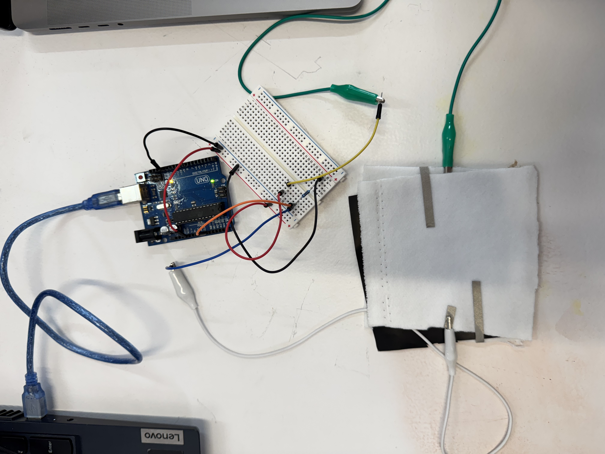
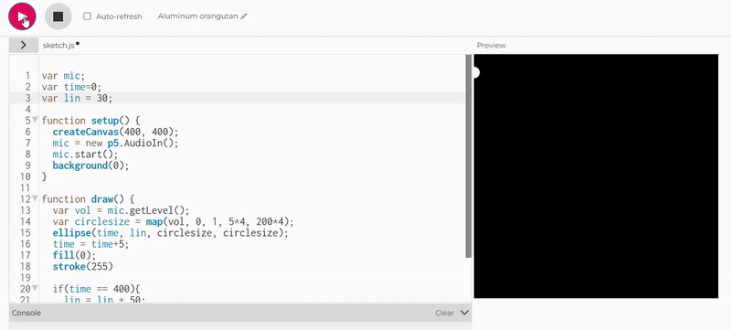
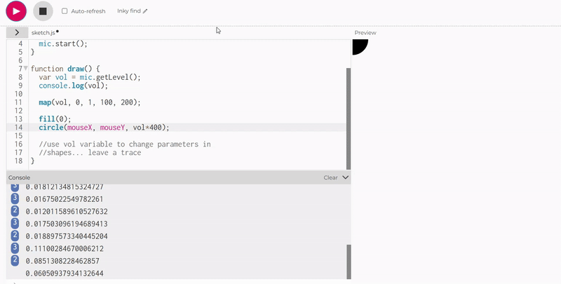
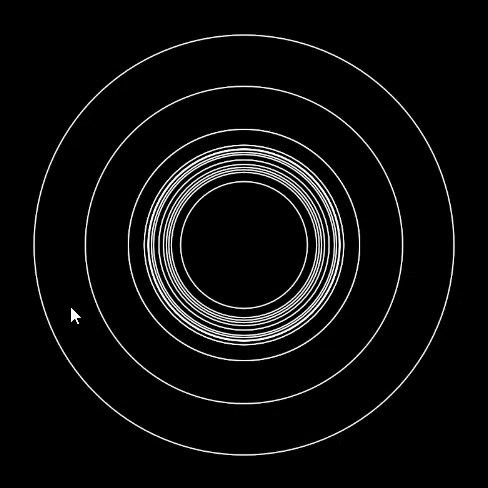

# H-n-MI_team04

In the course H(n)MI (short for Human (non-Human) Machine Interaction), we learned about how to collect data about the body with an Arduino and then how to process and visualize this data using processing or p5.js.

## first day

To get ourselves into the right mood, we started by assembling a pressure sensor from a piece of velostat, 2 pieces of conductive tape and 2 pieces of fabric.


To make our pressure sensor work, we need to connect it into a circuit together with another resistor. We used a 1K resistor between 3.3V and Ground, then we connected an Analog Pin from our Arduino between the two resistors to measure the changing volatage between the static and the variable velostat resistor.



We used a simple AnalogRead with the Arduino:


```
// Arduino code to read the pressure sensor
const int sensorPin = A0; // select the input pin for the sensor
int sensorValue = 0;      // variable to store the value coming from the sensor

void setup() {
  Serial.begin(9600); // initialize serial communication at 9600 bits per second
}

void loop() {
  sensorValue = analogRead(sensorPin); // read the value from the sensor
  Serial.println(sensorValue);         // print the sensor value to the serial monitor
  delay(100);                          // wait for 100 milliseconds
}
```

Then we connected the Arduino to Processing to use the value we get from the pressure sensor to affect a graphic display:


```
  import processing.serial.*;
  Serial mySerial;

  String myString;
  int nl=10;
  float myVal;

  void setup()
  {
    size(800, 600);
    printArray(Serial.list());
    delay(5000);
    String myPort = Serial.list()[8];
    mySerial = new Serial(this, myPort, 9600);
  }
  void draw(){
    while (mySerial.available() >0) {
      myString=mySerial.readStringUntil(nl);
      background(255, 0, 255);
      if (myString !=null) {

  myVal=float(myString);
        println(myVal);
        circle(width/2, height/2, myVal);
        smooth();
      }
    }
  }
```


## second day

On the second day, we started to experiment with p5.js. To get used to working with changing variables that we will be implementing in the following days from the arduino, we used the Microphone input of our computer for simulation purposes.





```
var mic;
var time=0;
var lin = 50;

function setup() {
  createCanvas(400, 400);
  mic = new p5.AudioIn();
  mic.start();
  background(0);
}

function draw() {
  var vol = mic.getLevel();
  var circlesize = map(vol, 0, 1, 5*10, 200*10);
  ellipse(time, lin, circlesize, circlesize);
  time = time+5;
  fill(0);
  stroke(255)
  
  if(time == 400){
    lin = lin + 50;
    time = 0;
  }
}
```

***

Also on the second day we also started thinking about different project ideas for this course:

### utilizing the pressure sensor
1. We thought about placing the pressure sensor below our feet to collect data about our the steps we take each day and also the time between the steps, so we could display a graph representing the _intensity_ or the _velocity_ of our lives.
2. Another idea was to place the pressure sensor on our butts to collect data on how much time of a day we spend sitting down.

### stalking a slime mold

The pressure sensor ideas were nice but also seemed a bit to straight forward for us so we decided to try to go for something a bit more extravagant: We want to record a video of a growing _physarum polycephalum_ slime mold and then use some sort of computer vision to classify different growth patterns and display the information we collected about that in p5.


## third day

On the third day we connected inputs from our DIY pressure sensor to p5.js with the Web Serial library.


We then kept experimenting a bit with different colors and threshholds for the pressure values:


Since we are currently not planning to actually use the pressure sensor for our project, we started thinking about different ways to realize our slime mold observation:

1. One way we want to explore is to take pictures of different grwoth patterns of the slime mold, classify them and use them to train an image recognition machine learning model. Then we could use a webcam that observes a growing slime mold and then visualize the different growth stages or patterns in p5.

2. The other way would be to count the amount of yellow pixels in certain specified areas of the camera resolution, which would give us very concrete data we could use for visualization. 


 


## references

Many code snippets and detailed instructions can be found in our teachers' repository:
[https://github.com/TURBULENTE/H-n-MI](https://github.com/TURBULENTE/H-n-MI)

